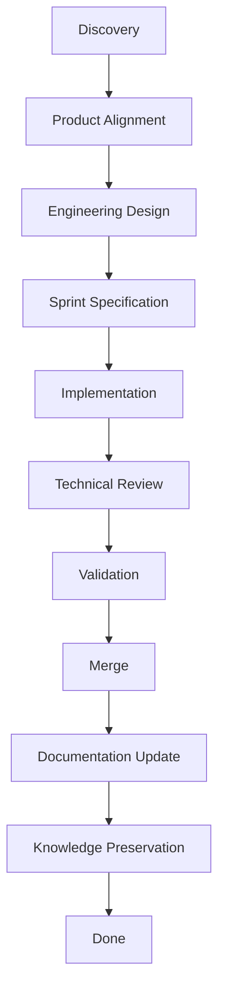
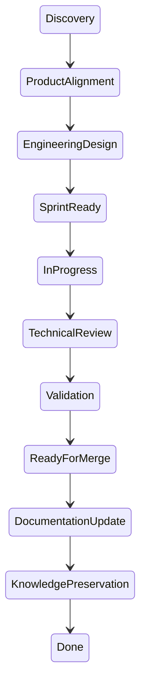
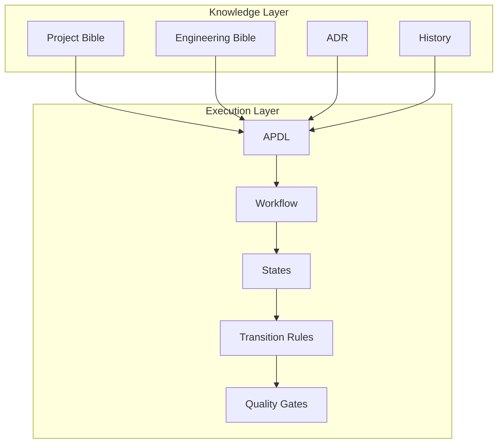
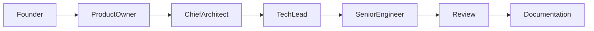
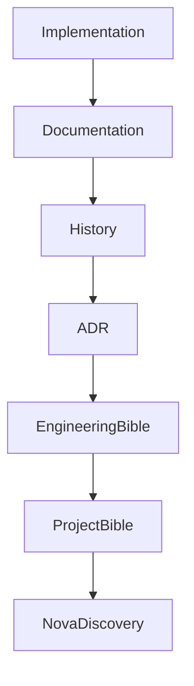

# APDL — Diagrams

> ID: APDL-009
> Status: 🧊 Frozen
> Versão: 1.0
> Última revisão: Sprint 1.5

---

# Objetivo

Este documento reúne os diagramas oficiais do AutoPilot Product Development Lifecycle (APDL).

Os diagramas complementam a documentação textual e oferecem uma visão rápida da estrutura da metodologia.

---

# Diagrama 1 — Visão Geral do APDL

## Objetivo

Apresentar o fluxo completo de uma demanda.

---

# Diagrama 2 — Máquina de Estados

## Objetivo

Representar os estados oficiais de uma demanda.

---

# Diagrama 3 — Camadas do APDL

## Objetivo

Representar a separação entre conhecimento e execução.

---

# Diagrama 4 — Responsabilidades

## Objetivo

Visualizar a colaboração entre papéis.

---

# Diagrama 5 — Fluxo do Conhecimento

## Objetivo

Mostrar como o conhecimento retorna ao sistema.

---

# Observações

Os diagramas representam a arquitetura oficial da versão atual do APDL.

Novos diagramas poderão ser adicionados conforme a metodologia evoluir.

Sempre que houver divergência entre diagramas e documentos textuais, prevalecem os documentos textuais.